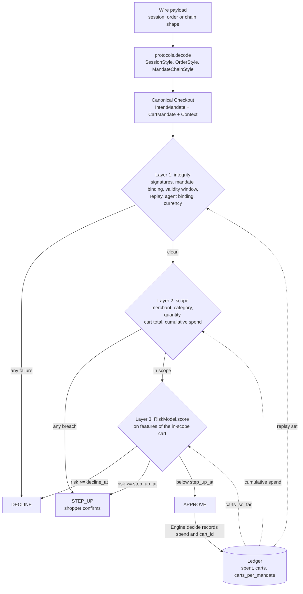
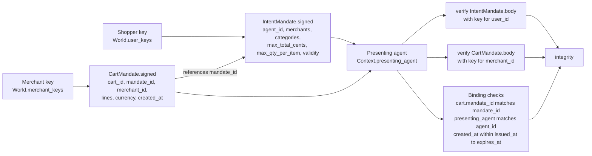
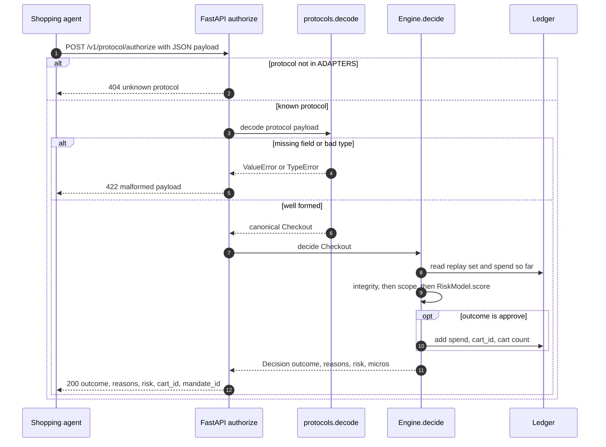

# Agentproof

[](https://github.com/ombdj1209/agentproof/actions/workflows/ci.yml)

**Risk and conformance lab for agent-initiated payments.** Simulated shopping agents (honest, confused and prompt-injected), mandate-scope verification, three mock protocol adapters decoding to one canonical checkout, and a layered decision engine evaluated on labelled traffic with an explicit euro cost model.

The core question it tests: card-era fraud models ask *"is this the cardholder?"*. When an AI agent buys on someone's behalf, the first question becomes *"is this within what the cardholder delegated?"*, and that question is deterministic.

All traffic, keys, merchants and shoppers are synthetic. The protocol adapters are mocks with deliberately different wire shapes, not spec-conformant implementations of any real protocol.

## At a glance

| | |
|---|---|
| **Problem** | Decide whether an agent-presented checkout is authorised, when the agent (not the cardholder) is at the keyboard |
| **Approach** | Three layers in strict order: cryptographic integrity, then delegated scope, then a behavioural model that only sees in-scope carts |
| **Headline result** | Expected cost of €1,719 per 1,000 attempts, against €5,828 for a card-era model: 71% lower, with 99.1% of honest traffic approved and 0.0% of delegation attacks approved |
| **Conformance** | The same 3,362 test attempts through three wire formats: decisions agree on 100.00%, round-trips exact on 100.00% |
| **Stack** | Python 3.11+, NumPy, scikit-learn, FastAPI; about 800 lines of package code |
| **Reproduce** | `python run_eval.py`: 45 s on one CPU core, regenerates `results/results.json` and `results/report.html` |

## Tech stack

| Layer | Technology | Used for |
|---|---|---|
| Language | Python 3.11+ | Everything; dataclasses for mandates, carts, checkouts and decisions |
| Cryptography | Python `hmac`, `hashlib` (HMAC-SHA256) | Signing and verifying intent and cart mandates over canonical JSON; constant-time comparison |
| Money handling | Python `decimal.Decimal` | Exact amount conversion in the protocol adapters, so round-trips never drift by a cent |
| Numerics | NumPy | Synthetic world generation, behavioural features, latency percentiles |
| Machine learning | scikit-learn `GradientBoostingClassifier` | Layer 3 `RiskModel` (card-era and in-scope behavioural models) |
| Web API | FastAPI | `POST /v1/{session,order,chain}/authorize` service in `agentproof/service.py` |
| ASGI server | Uvicorn | Running the service locally (`make serve`) |
| HTTP client | httpx | FastAPI `TestClient` in the HTTP tests |
| Reporting | Python `html`, `json` | `results/results.json` and a self-contained `results/report.html` |
| Testing | pytest | 13 tests: signatures, replay, agent binding, cumulative spend, round-trips, cross-protocol agreement, HTTP |
| Packaging | setuptools, `pyproject.toml`, Make | Editable install with a `dev` extra; `make test`, `make eval`, `make serve` |
| CI and supply chain | GitHub Actions, Dependabot | Tests on Python 3.11, 3.12 and 3.13; weekly dependency and action updates |

## Why this exists

In June 2026 Adyen launched Adyen Agentic: a product feed, a cart orchestration layer, and a payments and fraud layer for agent-led transactions that must work across competing protocols. Adyen has publicly rated agentic commerce maturity at about 0.5 out of 5 and named catalog normalisation, fraud liability and protocol fragmentation as the main barriers. Agentproof works on two of those three: **fraud liability** (who authorised this?) and **fragmentation** (does the same purchase get the same decision on every rail?).

## How it works

Every wire format is decoded into one protocol-independent `Checkout`. `Engine.decide` then runs three layers; the first layer that objects ends the evaluation. Only approved carts are written to the per-mandate `Ledger`, which the next request reads for replay and cumulative-spend checks and for the `carts_so_far` behavioural feature.



Within a layer every rule is evaluated, so a decision carries all its reasons (for example `["merchant_not_allowed", "category_not_allowed:giftcards"]`), not just the first.

### Mandates: who signs what

The shopper signs an `IntentMandate` (what the agent may do); the merchant signs a `CartMandate` (what it is asking to be paid for). Both are signed as HMAC-SHA256 over canonical JSON (`sort_keys`, compact separators) of every field except the signature. The agent carries both objects but holds neither key, so it cannot widen the scope or edit the cart.



`verify` uses `hmac.compare_digest` and fails closed when the key is unknown. Note that a valid merchant signature proves *who* built the cart, not that the cart is in scope: an attacker-controlled merchant can sign its own carts perfectly, which is why the merchant allow-list lives in Layer 2.

### Authorisation through the service



### Components

| Piece | File |
|---|---|
| Intent mandate (what the shopper delegated) and cart mandate (what the merchant asks for), signed over canonical JSON | `agentproof/mandate.py` |
| Session-style, order-style and mandate-chain adapters with exact round-trips | `agentproof/protocols.py` |
| Synthetic world and 15 labelled scenario generators | `agentproof/world.py` |
| Layered engine, per-mandate ledger, euro cost model | `agentproof/engine.py` |
| Threshold tuning, training sets, summaries | `agentproof/lab.py` |
| FastAPI service, one endpoint per protocol | `agentproof/service.py` |

### Traffic classes

| Class | Scenarios | Should be |
|---|---|---|
| Honest | In scope, allowed substitution, two carts within budget | Approved |
| Confused agent | One over the quantity limit, over budget, wrong category | Stepped up (not fraud, not authorised) |
| Delegation attack | Prompt-injected merchant swap, injected gift card, quantity inflation, replayed cart, expired mandate, forged signature, limit tampered after signing, wrong agent, split spend | Not approved |
| In-scope fraud | Account takeover: validly signed mandate, in-scope cart | Caught by behaviour only |

Prompt injection is modelled by its effect on the cart (a swapped merchant, an extra line, an inflated quantity), not by generating adversarial text.

## Repository layout

```
agentproof/
├── agentproof/
│   ├── mandate.py      IntentMandate, CartMandate, Line, Context, Checkout; canonical, sign, verify
│   ├── protocols.py    SessionStyle, OrderStyle, MandateChainStyle; ADAPTERS; decode
│   ├── engine.py       integrity, scope, features, RiskModel, Engine, Ledger, Costs, cost_eur
│   ├── world.py        World: synthetic keys, merchants, SKUs, agents and labelled Attempt generators
│   ├── lab.py          training-set builders, replay, cost-minimising threshold tuning, summarise
│   ├── report.py       self-contained HTML report from results.json
│   └── service.py      build_app: FastAPI surface over one shared Engine
├── tests/
│   └── test_agentproof.py
├── results/
│   ├── results.json    every number in this README
│   └── report.html
├── run_eval.py         end-to-end evaluation; --quick for a smaller run
├── pyproject.toml
├── Makefile            install, test, eval, serve
├── LICENSE
└── SECURITY.md
```

## Threat model

What each scenario breaks, which layer catches it, and what the layered engine did on the test set (`results/results.json`, `engines.layered.by_class`).

| Attack | Reason code | Caught by | Decision |
|---|---|---|---|
| Forged mandate signature | `mandate_signature_invalid` | Layer 1 | Decline |
| Limit raised after the shopper signed | `mandate_signature_invalid` | Layer 1 | Decline |
| Cart edited after the merchant signed | `cart_signature_invalid` | Layer 1 | Decline (unit test) |
| Replayed, already approved cart | `cart_replayed` | Layer 1, via ledger | Decline |
| Cart created outside the mandate's validity window | `mandate_expired_or_not_yet_valid` | Layer 1 | Decline |
| Another agent presents the mandate | `agent_not_delegate` | Layer 1 | Decline |
| Cart bound to a different mandate, or in another currency | `cart_not_bound_to_mandate`, `currency_mismatch` | Layer 1 | Decline (rule exists; not in generated traffic) |
| Prompt-injected merchant swap | `merchant_not_allowed` | Layer 2 | Step-up |
| Injected gift card line | `category_not_allowed:giftcards` | Layer 2 | Step-up |
| Quantity inflation | `quantity_above_limit` | Layer 2 | Step-up |
| Split spend: several carts, each under the limit | `cumulative_spend_above_limit` | Layer 2, via ledger | Step-up; a small remainder declined by Layer 3 |
| Account takeover: valid mandate, in-scope cart | `behavioural_risk_high` / `_elevated` | Layer 3 only | 84.8% declined, 5.5% stepped up, 9.8% approved |

Out of scope: compromise of the shopper's or merchant's signing key (a signed mandate is taken as the shopper's intent; that residual risk is what Layer 3 exists for), agent-side prompt-injection detection, and network-level attacks on the service.

## Results

`python run_eval.py`: 45 s on one CPU core. Train, validation and test come from three separate synthetic worlds (different keys, shoppers and mandates). Thresholds are tuned on validation to minimise expected cost, then frozen. Test set: 3,362 attempts (2,617 honest, 263 confused, 318 delegation attacks, 164 account takeovers).

| Engine | Cost per 1,000 attempts | Honest approved | Delegation attacks approved | Account takeovers approved | p99 latency |
|---|---|---|---|---|---|
| Card-era model (device, address, IP, amount) | €5,828 | 0.1% | 0.0% | 0.0% | 327 µs |
| Delegation checks only | €7,631 | 100.0% | 0.0% | 100.0% | 91 µs |
| **Layered (checks, then behaviour)** | **€1,719** | **99.1%** | **0.0%** | **9.8%** | 427 µs |

**Reading it:**

- **The card-era model can only stop attacks by stepping up 99.8% of honest shoppers.** Its signals cannot tell a prompt-injected merchant swap from a normal purchase, so the cheapest policy it can reach is to challenge everyone. It blocks everything and converts nothing.
- **Delegation checks alone stop every delegation attack with zero honest friction**, because each attack breaks a verifiable rule. They are blind to account takeover, where the mandate is genuinely signed.
- **Layering fixes both.** Checks handle delegation, and the behavioural model only sees carts that are already in scope, where it catches 90% of account takeovers (84.8% declined, 5.5% stepped up) while approving 99.1% of honest traffic. Expected cost is 71% below the card-era model.
- **Confused agents are never silently approved**: 100% are sent back to the shopper for confirmation instead of being declined as fraud.

### Same purchase, every protocol

All 3,362 test attempts were encoded in each of the three wire formats, decoded and decided by a fresh engine per protocol: **decisions agree on 100.00%** and **encode/decode round-trips are exact on 100.00%**. Risk logic is written once, and the conformance suite proves it behaves identically on every rail.

## Evaluation methodology

**Data.** `World(seed)` builds an independent universe: 400 shoppers, 25 agents, 18 legitimate and 4 attacker merchants, per-seed signing keys and a SKU catalogue. `run_eval.py` uses seed 1 for training, 2 for validation and 3 for test, so no key, shopper, mandate or cart is shared between splits. `World.traffic(n)` makes `n` generator calls with a fixed mix (62% honest, 8% substitution, 8% two carts, 8% confused, 8% attack, 6% account takeover); some calls emit several attempts (two carts, a replay and its original, four split-spend carts), so 3,000 test calls produce 3,362 labelled attempts. The first cart of a replay pair or a split-spend group is labelled honest, because on its own it is.

**Models.** Both engines that use a model share `RiskModel`, a `GradientBoostingClassifier` (200 trees, depth 3, learning rate 0.05, fixed seed).

- The layered model is trained by `behaviour_training_set` only on rows that pass `integrity` and `scope`, with account takeover as the positive class. It is trained on the distribution it will serve, not on attacks the rules already stop.
- The card-era model is trained by `card_era_training_set` on every row, positive for anything not honest, using only the four columns in `CARD_ERA_FEATURES` (new device, new ship address, IP risk, log amount).

**Threshold tuning.** `lab.tune` grid-searches `(step_up_at, decline_at)` pairs over ten values from 0.05 to 0.95, with `decline_at >= step_up_at`, replays the validation world through a fresh engine for each pair and keeps the pair with the lowest total expected cost. Thresholds are then frozen and applied once to the test world. Delegation checks only has no model, so it approves anything that passes Layers 1 and 2.

**Cost model.** `Costs` and `cost_eur` price every (truth, outcome) pair in euros, so the objective is the business outcome rather than AUC:

| Truth | Approve | Step-up | Decline |
|---|---|---|---|
| Honest | 0 | €0.30 + 12% abandonment × 25% margin × amount | €2.00 friction + 25% margin × amount |
| Confused | 35% dispute share × (amount + €15 chargeback) | €0.30 | €2.00 |
| Delegation attack | amount + €15 chargeback | €0.30 + 5% × loss (step-up stops 95%) | 0 |
| Account takeover | amount + €15 chargeback | €0.30 + 60% × loss (step-up stops 40%) | 0 |

**Latency.** `Engine.decide` times each decision with `time.perf_counter`; p50 and p99 are reported per engine over the whole test set.

**Conformance.** For each adapter, every test attempt is encoded, decoded and compared field by field with the original (`IntentMandate`, `CartMandate` and `Context` are frozen dataclasses, so equality is structural), then decided by a fresh engine with the layered thresholds. Agreement is the share of attempts on which all three protocols reach the same outcome.

## Key engineering decisions

- **Deterministic before probabilistic.** A signature, an expiry or an allow-list is either satisfied or not. Running a model before those checks wastes its capacity on cases a rule answers exactly, and makes the rule's answer negotiable.
- **Scope breaches are stepped up, not declined.** A confused agent is not a fraudster; the shopper gets a chance to approve. Integrity failures (forged, tampered, replayed, wrong agent) are declined outright.
- **The ledger enforces cumulative spend.** Split-spend attacks pass every per-cart check; only per-mandate state catches them. Only approved carts consume budget.
- **The merchant signature covers cart contents.** Editing one line after signing is detected (tested).
- **Costs are explicit.** False declines lose margin, step-ups lose a share of honest shoppers, approved attacks cost the amount plus a chargeback fee, and step-ups stop 95% of attackers but only 40% of account takeovers. Changing these moves the tuned thresholds, which is the point.
- **One canonical model, thin adapters.** Adapters only translate shape (decimal strings versus minor units, ISO versus Unix timestamps, nested versus flat). Money is held as integer cents and converted through `Decimal`, so round-trips are exact rather than approximately equal. Adding a protocol means one `encode`/`decode` pair and an entry in `ADAPTERS`; the risk code does not change.
- **Signatures are over canonical bytes, not wire bytes.** The adapters re-encode fields freely, yet signatures still verify on every rail, because `verify` recomputes the MAC over the canonical body of the decoded object.
- **All reasons, not the first.** Each layer returns every rule it failed, which makes decisions explainable to a merchant or a disputes team and makes the tests precise about *why* something was declined.
- **A small price tolerance.** `SCOPE_TOLERANCE` allows 2% drift above the mandate limit before it counts as a scope breach, so a price change between planning and checkout does not bounce an honest cart.

## Testing strategy

`tests/test_agentproof.py` runs 13 tests (11 functions, one parametrised over the three adapters) against a fixed `World(seed=11)`:

| Area | Tests |
|---|---|
| Happy path | 50 honest in-scope carts are all approved |
| Integrity | A zeroed mandate signature and a limit raised after signing are both declined with `mandate_signature_invalid`; a one-cent edit to a signed cart gives `cart_signature_invalid`; a mandate presented by another agent gives `agent_not_delegate` |
| Ledger state | The same cart is approved once and then declined with `cart_replayed`; two carts at 45% of the limit are approved and the third is stepped up with `cumulative_spend_above_limit` |
| Scope | 40 confused-agent carts are never approved |
| Adapters | For each of the three protocols, 80 generator calls of mixed traffic round-trip to identical canonical objects |
| Cross-protocol agreement | 150 generator calls through all three adapters give identical decision sequences, ledger state included |
| Economics | `cost_eur` orders outcomes correctly: for honest traffic approve < step-up < decline; for attacks the reverse |
| HTTP | Each protocol endpoint approves a valid payload via `TestClient`; a malformed body returns 422 and an unknown protocol 404 |

The evaluation itself is the second line of defence: `run_eval.py --quick` runs the full pipeline (training, tuning, test and conformance) on a smaller world and is suitable for CI.

## Run it

Requires Python 3.11+.

```bash
pip install -e ".[dev]"
python -m pytest -q        # 13 tests: signatures, replay, agent binding, cumulative spend, round-trips, cross-protocol agreement, HTTP
python run_eval.py         # full evaluation, under a minute
open results/report.html
uvicorn agentproof.service:app --port 8000   # POST /v1/{session|order|chain}/authorize
```

The `Makefile` wraps the same commands as `make install`, `make test`, `make eval` and `make serve`.

## API

| Method and path | Purpose |
|---|---|
| `GET /v1/protocols` | Lists the adapters: `["chain", "order", "session"]` |
| `POST /v1/{protocol}/authorize` | Decodes the payload with that protocol's adapter and returns the engine's decision |

The default `app` builds its keys from `World(seed=0)` and runs delegation checks only (no behavioural model is loaded), so `risk` is always 0 there. Use `build_app(engine)` to serve an engine with a trained `RiskModel`.

A mandate-chain request. Signatures must be valid for the server's keys, so the easiest way to get a working payload is to generate one from the same world:

```python
import httpx
from agentproof.protocols import MandateChainStyle
from agentproof.world import World

checkout = World(seed=0).honest()[0].checkout          # same seed as the default service
payload = MandateChainStyle.encode(checkout)
print(httpx.post("http://localhost:8000/v1/chain/authorize", json=payload).json())
```

That produces this body:

```json
{
  "intent_mandate": {
    "mandate_id": "mdt-000001",
    "user_id": "u0011",
    "agent_id": "agent-16",
    "merchants": ["m01", "m13"],
    "categories": ["groceries"],
    "max_total_cents": 17499,
    "max_qty_per_item": 2,
    "currency": "EUR",
    "issued_at": 1782021429,
    "expires_at": 1782154629,
    "allow_substitution": true,
    "signature": "2528a420df5f8580f43eacf820cfa8cf90802ef525dfe155ffe1f8fa89d85fc1"
  },
  "cart_mandate": {
    "cart_id": "cart-000002",
    "mandate_ref": "mdt-000001",
    "merchant": "m01",
    "currency": "EUR",
    "created_at": "2026-06-21T21:34:16Z",
    "contents": [["m01-s10", "groceries", 2, 6266]],
    "merchant_authorization": "842810bfe885eb3612399a57c60fc2849d38d0dae7d8582bd9076f1763fa9615"
  },
  "payment_mandate": {
    "agent_id": "agent-16",
    "agent_reputation": 0.7111525875789857,
    "new_device": false,
    "new_ship_address": false,
    "ip_risk": 0.25279016526008985
  }
}
```

The first call is approved; sending the same body again is declined as a replay:

```json
{"outcome": "approve", "reasons": [], "risk": 0.0, "cart_id": "cart-000002", "mandate_id": "mdt-000001"}
{"outcome": "decline", "reasons": ["cart_replayed"], "risk": 0.0, "cart_id": "cart-000002", "mandate_id": "mdt-000001"}
```

A payload missing a required field returns `422` with a detail such as `malformed session payload: missing 'checkout_session'`.

## Limitations

- HMAC-SHA256 stands in for the public-key or verifiable-credential signatures a real protocol would use. The verification flow is the same; the key distribution problem is not modelled.
- The three adapters are mocks inspired by how public protocols differ in shape (session, order, mandate chain). They are not implementations of ACP, UCP or AP2.
- The behavioural signals and the account-takeover distribution are synthetic, so the 90% catch rate measures the architecture, not a real-world detection rate.
- The ledger is in-process. Production needs a strongly consistent store keyed by mandate, or split-spend checks race.
- Latency includes a scikit-learn single-row prediction (about 200 µs). A compiled model would be far faster.

## Production-readiness gaps

Beyond the limitations above, these are the things that would have to change before this handled real money:

- **Concurrency.** The service shares one `Engine` and one in-memory `Ledger` across FastAPI's worker threads with no locking, and nothing survives a restart. The read-check-write in `Engine.decide` needs to be one atomic operation against a durable store (for example a conditional write per mandate).
- **Step-up is a dead end.** A `step_up` response has no confirmation endpoint, so a cart the shopper later approves never consumes budget and never enters the replay set.
- **Replay protection covers approved carts only.** A declined or stepped-up `cart_id` can be resubmitted and is evaluated afresh; a production system would also want nonces or idempotency keys.
- **Trusted timestamps.** The validity-window check compares the mandate against the merchant-signed `created_at`, not server time. A colluding or compromised merchant can backdate a cart.
- **Input validation.** Endpoints accept a raw `dict`; only missing keys and type errors map to 422. Typed request schemas (Pydantic models per protocol) would give precise errors and prevent other malformed shapes from surfacing as 500s.
- **No authentication, rate limiting or audit log** on the HTTP surface.
- **Model lifecycle.** Models are trained in process on each evaluation run. There is no persistence, versioning, drift monitoring or champion-challenger path, and the default service loads no model at all.
- **Key management.** Keys are derived deterministically from a seed. Real deployment needs key discovery, rotation and revocation.

## Next steps

1. Replace HMAC with Ed25519 plus a key-discovery endpoint, and test key rotation.
2. Add a prompt-injection corpus: product descriptions that try to redirect agents, scored for which get through to Layer 2.
3. Per-merchant liability rules: who pays when a confused agent's step-up is approved by the shopper, and later disputed.
4. Property-based fuzzing of the adapters with malformed payloads.

## Security

This is a research lab, not a payments system; do not use its keys, signatures or ledger to protect real transactions. To report a vulnerability, see [SECURITY.md](SECURITY.md).

## License

MIT. See [LICENSE](LICENSE).
